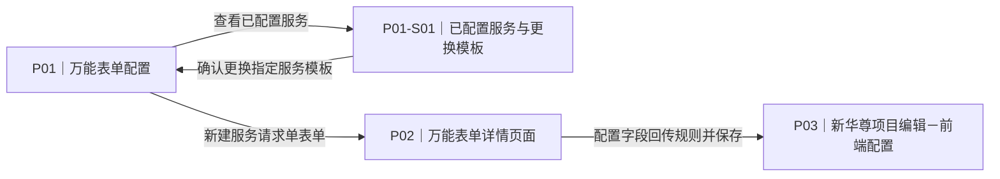
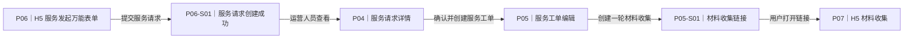
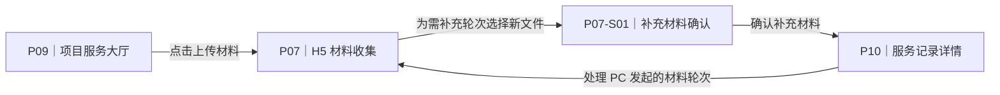
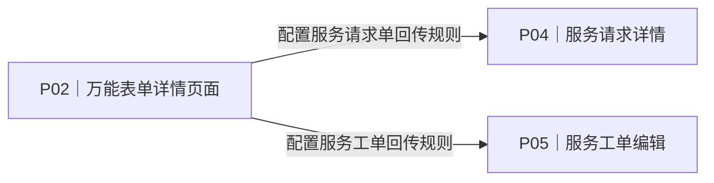

# WEC v2.2.6-v2｜新华尊项目原型设计文档

| 项目 | 内容 |
| --- | --- |
| 原型设计状态 | `设计中` |
| 本次目标 | 设计新华尊项目的服务请求单配置、服务发起、服务请求/服务工单回传、多轮材料收集及内部手动推送报告功能。 |

> 说明：客户确认流程图不展示报告推送；R07“运营人员手动推送报告”仅作为睿聆内部研发原型设计。

## 1. 人工审核摘要

### 1.1 页面范围与改动摘要

| 页面编号 | 页面名称 | 现有/新增 | 改动摘要 | 对应需求 |
| --- | --- | --- | --- | --- |
| P01 | 万能表单配置（PC 端） | 现有 | 增加表单类别筛选和维护，支持“服务请求单”类别；可查看使用该表单的服务并替换其模板。 | R08 |
| P01-S01 | 已配置服务与更换模板（PC 端） | 新增 | 查看当前表单已配置到哪些项目服务，并可逐项更换服务请求单模板。 | R08 |
| P02 | 万能表单详情页面（PC 端） | 现有 | 在字段右侧配置区增加回传规则：是否回传、回传字段名称、回传阶段、字段回传时机。 | R06、R08 |
| P03 | 项目编辑－前端配置（PC 端） | 现有 | 增加“是否收集用户信息”；选择“是”后选择当前项目的备案字段；每项服务绑定一份服务请求单模板。 | R01、R08 |
| P04 | 服务请求详情（PC 端） | 现有 | 展示服务请求单信息，并提供创建服务工单入口。 | R04、R06 |
| P05 | 服务工单编辑（PC 端） | 现有 | 创建工单时展示服务请求信息，并可将本次用户信息备案为会员；支持创建多轮材料收集链接和“预约成功”状态。 | R04、R05、R06 |
| P05-S01 | 材料收集链接（PC 端） | 新增 | 创建材料收集链接并复制，供运营人员发送给用户。 | R05 |
| P06 | H5 服务发起万能表单（H5 端） | 新增 | 用户发起某项服务时，加载后台为该服务绑定的服务请求单万能表单；填写并提交后创建服务请求。需先验证免备案、免鉴权、免权益绑定能力。 | R01、R02、R03、R08 |
| P06-S01 | 服务请求创建成功（H5 端） | 新增 | 后台万能表单校验通过并成功创建服务请求后展示结果。 | R04 |
| P07 | H5 材料收集（H5 端） | 新增 | 只展示 PC 已创建的待上传或需补充材料轮次；用户按轮次上传或补充材料，并保留历史文件。 | R05 |
| P07-S01 | 补充材料确认（H5 端） | 新增 | 用户为 PC 发起的“需补充”轮次上传新文件前，明确提示旧文件将保留为“已替换”。 | R05 |
| P09 | 项目服务大厅（H5 端） | 现有 | 在项目首页增加“上传材料”入口、待上传材料数量和红点提醒，直达材料收集页面。 | R05 |
| P10 | 服务记录详情（H5 端） | 新增 | 展示服务详情、每轮材料收集记录及已上传、已替换文件；报告推送后可在此查看报告。 | R05、R07 |
| P08 | 报告解读工单（PC 端） | 现有 | 完成报告后，运营人员可手动推送报告给用户。 | R07 |
| P08-S01 | 推送报告确认（PC 端） | 新增 | 手动推送前确认接收对象和报告内容，成功后记录推送结果。 | R07 |

> `Pxx-Sxx` 只用于弹窗、抽屉、拦截、确认或结果等必须单独演示的关键画面。普通页签、输入、下拉和 Toast 不编号。

### 1.2 截图预览与打开方式

| 页面编号 | 截图预览 | 打开方式 |
| --- | --- | --- |
| P01 | [万能表单配置](../../../pape-materials/page-materials/screenshots/pc-universalform-default.png) | PC：业务工作台 → 万能表单配置。 |
| P01-S01 | 新增，无现状截图 | 在 P01 的服务请求单表单操作中点击“已配置服务”。 |
| P02 | [万能表单详情页面](../../../pape-materials/page-materials/screenshots/pc-formdesignermobile-default.png) | PC：万能表单配置 → 选择 H5 表单 → 编辑表单详情。 |
| P03 | [项目 H5 配置](../WEC-v2.2.5/assets/current-state/P01-S02-project-h5-config.png) | PC：业务工作台 → 项目管理 → 编辑新华尊项目 → 第三步“前端配置”。 |
| P04 | [服务请求详情](../WEC-v2.2.6/assets/current-state/P02-S01-service-request-detail.png) | PC：客服工作台 → 服务请求管理 → 查看。 |
| P05 | [通用工单编辑](../../../pape-materials/page-materials/screenshots/pc-commonticket-pc-commonticket-edit.png) | PC：客服工作台 → 工单 → 通用工单 → 新增/编辑。 |
| P05-S01 | 新增，无现状截图 | 在 P05 的材料收集区域点击“生成材料收集链接”。 |
| P06 | 新增，无现状截图 | H5：用户通过新华尊提供的、包含加密用户号的服务链接进入。 |
| P06-S01 | 新增，无现状截图 | 在 P06 完成必填项后提交服务请求。 |
| P07 | 新增，无现状截图 | H5：从 P09 的“上传材料”入口、P10 的服务记录详情或 P05-S01 生成的材料链接进入。 |
| P07-S01 | 新增，无现状截图 | 在 P07 的“需补充”材料轮次选择新文件。 |
| P09 | [H5 服务大厅（仅作视觉参考）](../WEC-v2.2.5/assets/current-state/P02-h5-service-hall.png) | H5：打开 `/home`。 |
| P10 | 新增，无现状截图 | H5：服务记录 → 点击一条服务记录 → 服务记录详情。 |
| P08 | [报告解读工单](../../../pape-materials/page-materials/screenshots/pc-health-report-ticket-edit-health-report-ticket.png) | PC：客服工作台 → 工单 → 报告解读工单 → 编辑。 |
| P08-S01 | 新增，无现状截图 | 在 P08 报告已完成时点击“推送报告”。 |

> P09 仅有 v2.2.5 的视觉参考截图，需人工补充当前 H5 服务大厅截图后才可进入该页面的 HTML 制作。

### 1.3 关键流程

#### F01｜配置服务请求单

- 关联需求：R06、R08
- 简短说明：运营人员先创建“服务请求单”类别的万能表单，再配置字段回传规则，并将表单绑定到新华尊项目服务。

#### F02｜用户发起服务与材料收集

- 关联需求：R01、R02、R03、R04、R05、R08
- 简短说明：用户从新华尊 H5 链接进入并提交服务请求；运营人员确认后创建服务工单，需要材料时生成链接，用户在 H5 上传材料。

#### F05｜从首页或服务记录补充材料

- 关联需求：R05
- 简短说明：用户只能处理 PC 已创建的材料轮次；可从项目首页快速进入，也可在服务记录详情查看每轮材料和历史文件。

#### F03｜服务数据回传

- 关联需求：R06
- 简短说明：服务请求单和服务工单分别在配置的状态节点回传固定字段及已勾选的万能表单字段。

#### F04｜内部手动推送报告

- 关联需求：R07
- 简短说明：报告完成后，睿聆运营人员在内部报告解读工单中确认并手动推送报告给 H5 端用户；该流程不属于客户确认流程图。

### 1.4 制作确认

> 确认结论：`待人工确认`。请补充 P09 当前 H5 服务大厅截图，并确认页面范围和关键状态；确认后再沿用 v2.2.6 现有原型承载框架制作 HTML 原型。

## 2. 按页面制作细节

### P01｜万能表单配置

#### 对应需求

- R08

#### 现状基线

- 当前页面提供万能表单列表、关键字检索、新增和编辑入口；表单基础信息包括名称、编码、描述和适用端。
- 当前列表没有表单类别、已绑定服务数量和已绑定服务查看入口。

#### 迭代依据

- 对应需求：R08｜服务请求单改为由万能表单配置。
- 相对现状的设计结论：在现有万能表单配置中新增表单类别，并为服务请求单提供已绑定服务查看和模板替换入口。

#### 页面迭代设计

- 页面区域与内容：筛选区增加“表单类别”；列表增加“表单类别”列；新增/编辑表单时增加类别选择；服务请求单表单操作区增加“已配置服务”，涉及 P01-C01、P01-C02、P01-C03。
- 关键操作与结果：保存“服务请求单”类别且适用端为 H5 的表单后，该表单可在 P03 的服务配置中选择；点击“已配置服务”进入 P01-S01，查看绑定关系或替换某一项服务的模板，见 F01。

#### 本页改动

| 改动编号 | 改动与预期表现 |
| --- | --- |
| P01-C01 | 在列表筛选区增加表单类别：全部、健康档案、工单、服务请求单；列表同步展示类别。 |
| P01-C02 | 新增/编辑表单时必须选择表单类别；“服务请求单”类别的表单用于绑定项目服务。 |
| P01-C03 | “服务请求单”表单增加“已配置服务”操作，展示已绑定的项目和服务，并允许逐项更换为另一份“服务请求单”类别、适用端为 H5 的模板。 |

#### 默认状态

- 显示全部表单，列表中可见类别标签；预置一条“新华尊－海外 MDT 服务请求单”H5 表单及“已配置服务”操作。

#### 关键状态

| 状态编号 | 状态名称 | 触发条件 | 页面表现 | 可执行操作及结果 |
| --- | --- | --- | --- | --- |
| P01-S01 | 已配置服务与更换模板 | 点击一份“服务请求单”表单的“已配置服务”。 | 抽屉逐行展示项目名称、服务名称、当前模板和启用状态；每行提供“更换模板”。 | 选择另一份“服务请求单”类别且适用端为 H5 的模板并确认，只更新当前行对应服务的模板绑定；取消或关闭不保存。 |

#### 关联流程

- F01

#### 材料卡

| 对象编号 | 截图 | 路由/打开方式 | 源码 | JSON | 用途与缺口 |
| --- | --- | --- | --- | --- | --- |
| P01 | [截图](../../../pape-materials/page-materials/screenshots/pc-universalform-default.png) | `/biz/universalform`；业务工作台 → 万能表单配置。 | `code-yuanma/wec-frontend-前端/src/views/biz/universalform/index.vue`、`form.vue` | `pape-materials/page-materials/pages/pc-universalform.json` | 截图用于列表视觉与结构参考；源码确认现有检索、新增和编辑能力。 |
| P01-S01 | 新增，无现状截图 | 在 P01 的服务请求单表单操作中点击“已配置服务”。 | `code-yuanma/wec-frontend-前端/src/views/biz/universalform/index.vue`、`form.vue` | `pape-materials/page-materials/pages/pc-universalform.json` | 新增已配置服务查看及模板替换抽屉。 |

#### 原型文件

`pages/P01-universal-form.html`

### P02｜万能表单详情页面

#### 对应需求

- R06、R08

#### 现状基线

- 当前页面提供组件面板、H5 画布和右侧字段配置区，用于维护 H5 万能表单字段。
- 当前右侧字段配置区没有“是否回传、回传字段名称、回传阶段、字段回传时机”四项配置。

#### 迭代依据

- 对应需求：R06｜服务请求单和服务工单分别按字段配置和状态节点回传数据。
- 相对现状的设计结论：在每个字段的右侧配置区新增四项回传配置；字段的显示、必填和校验规则保持原有逻辑。

#### 页面迭代设计

- 页面区域与内容：右侧字段配置区新增“数据回传配置”分组，包含是否回传、回传字段名称、回传阶段和字段回传时机，涉及 P02-C01、P02-C02。
- 关键操作与结果：是否回传选择“否”时，其他三项隐藏且该字段不回传；选择“是”时，必须填写回传字段名称、回传阶段和字段回传时机后才能保存，见 F01、F03。

#### 本页改动

| 改动编号 | 改动与预期表现 |
| --- | --- |
| P02-C01 | 增加“是否回传”开关；选择“否”时不回传该字段，选择“是”时显示并要求完成其余三项配置。 |
| P02-C02 | 增加回传字段名称、回传阶段（服务请求单/服务工单）和字段回传时机；回传时机下拉仅展示所选阶段的状态，状态及新华尊对应关系以 PRD 2.2.4 为准。 |

#### 默认状态

- 打开“新华尊－海外 MDT 服务请求单”表单；未选中字段时右侧不显示数据回传配置，选中字段后显示该字段的配置值。

#### 关键状态

无。

#### 关联流程

- F01、F03

#### 材料卡

| 对象编号 | 截图 | 路由/打开方式 | 源码 | JSON | 用途与缺口 |
| --- | --- | --- | --- | --- | --- |
| P02 | [截图](../../../pape-materials/page-materials/screenshots/pc-formdesignermobile-default.png) | `/biz/formdesignermobile?clientType=H5`；由 P01 编辑 H5 表单进入。 | `code-yuanma/wec-frontend-前端/src/views/biz/formdesignermobile/index.vue`、`render.vue` | `pape-materials/page-materials/pages/pc-formdesignermobile.json` | 截图用于三栏设计器结构；源码确认 H5 表单设计入口。 |

#### 原型文件

`pages/P02-universal-form-detail.html`

### P03｜新华尊项目编辑－前端配置

#### 对应需求

- R01、R08

#### 现状基线

- 当前项目编辑采用“基础信息、产品配置、前端配置”三步配置；前端配置中按服务维护 H5 服务内容。
- 当前“前端配置”步骤的实际截图缺失，需人工补充；现有截图只可作为项目编辑整体布局参考。

#### 迭代依据

- 对应需求：R01、R08｜新华尊项目配置 H5 是否收集用户基本信息；选择收集时指定备案字段；并为每项服务绑定服务请求单模板。
- 相对现状的设计结论：仅在新华尊项目的前端配置中新增项目级“是否收集用户信息”开关、备案字段选择和服务级模板选择；其他项目不显示这三项配置。

#### 页面迭代设计

- 页面区域与内容：项目级 H5 配置增加“是否收集用户信息”；选择“是”后显示“备案字段”下拉；每项服务增加“服务请求单模板”下拉；原型页面增加“仅项目链接生效，通用链接不生效”说明，涉及 P03-C01、P03-C02、P03-C03、P03-C04。
- 关键操作与结果：选择“否”时用户进入 H5 不填写基础用户信息；选择“是”时必须在“备案字段”下拉中选择当前项目的备案字段后才能保存；每项服务保存模板后，用户发起该服务时加载该服务绑定的模板，见 F01、F02。

#### 本页改动

| 改动编号 | 改动与预期表现 |
| --- | --- |
| P03-C01 | 新华尊项目的 H5 配置增加“是否收集用户信息”单选，默认选择“否”；选择“否”时 H5 入口不展示基础用户信息填写项。 |
| P03-C02 | 选择“是”后显示“备案字段”下拉，只展示当前项目已配置的备案字段；至少选择一个字段后才能保存。 |
| P03-C03 | 每项服务增加“服务请求单模板”下拉，只展示“服务请求单”类别、适用端为 H5、状态为启用的表单；每项服务只能绑定一份模板。 |
| P03-C04 | 在配置区域标注“仅项目链接生效，通用链接不生效”，用于原型说明本开关的适用范围。 |

#### 默认状态

- 打开新华尊项目的第三步“前端配置”；“是否收集用户信息”预置为“否”，备案字段下拉隐藏，海外 MDT 服务已绑定“新华尊－海外 MDT 服务请求单”。

#### 关键状态

无。

#### 关联流程

- F01、F02

#### 材料卡

| 对象编号 | 截图 | 路由/打开方式 | 源码 | JSON | 用途与缺口 |
| --- | --- | --- | --- | --- | --- |
| P03 | [项目 H5 配置](../WEC-v2.2.5/assets/current-state/P01-S02-project-h5-config.png) | `/biz/project`；编辑项目 → 第三步“前端配置”。 | `code-yuanma/wec-frontend-前端/src/views/biz/project/form.vue` | `pape-materials/page-materials/pages/pc-business-project-management.json` | 截图展示现有 H5 前端配置结构；本次在此基础上增加用户信息收集及服务请求单模板绑定。 |

#### 原型文件

`pages/P03-project-h5-config.html`

### P04｜服务请求详情

#### 对应需求

- R04、R06

#### 现状基线

- 当前服务请求管理提供列表和详情入口，详情展示 C 端提交的信息及服务请求状态。
- 当前服务请求详情的实际截图缺失，需人工补充；服务请求列表截图仅用于视觉参考。

#### 迭代依据

- 对应需求：R04、R06｜用户发起服务后收集服务请求单信息；服务请求单在状态变化时回传数据。
- 相对现状的设计结论：详情按绑定的万能表单展示信息，并提供确认后创建服务工单的入口；状态变化触发已配置字段的回传。

#### 页面迭代设计

- 页面区域与内容：服务请求信息区按服务请求单表单展示；服务信息区展示请求单号、项目、服务、状态和发起时间，涉及 P04-C01、P04-C02。
- 关键操作与结果：运营人员确认真实服务后创建服务工单；服务请求状态进入配置节点时回传固定字段和配置字段，见 F02、F03。

#### 本页改动

| 改动编号 | 改动与预期表现 |
| --- | --- |
| P04-C01 | 服务请求详情按该服务绑定的服务请求单模板展示用户填写内容。 |
| P04-C02 | 增加“创建服务工单”入口；服务请求状态进入字段配置的回传时机时，回传固定字段和已配置回传的表单字段。 |

#### 默认状态

- 展示一条“待处理”的新华尊服务请求，包含项目、服务、发起时间及用户填写的服务请求单信息。

#### 关键状态

无。

#### 关联流程

- F02、F03

#### 材料卡

| 对象编号 | 截图 | 路由/打开方式 | 源码 | JSON | 用途与缺口 |
| --- | --- | --- | --- | --- | --- |
| P04 | [服务请求详情](../WEC-v2.2.6/assets/current-state/P02-S01-service-request-detail.png) | `/biz/servicerequest`；客服工作台 → 服务请求管理 → 查看。 | `code-yuanma/wec-frontend-前端/src/views/biz/servicerequest/index.vue`、`detail.vue` | `pape-materials/page-materials/pages/pc-customer-service-request.json` | 截图用于服务请求详情的内容区与跟进区布局参考；本次在此基础上展示服务请求单字段和创建服务工单入口。 |

#### 原型文件

`pages/P04-service-request-detail.html`

### P05｜服务工单编辑

#### 对应需求

- R04、R05、R06

#### 现状基线

- 当前通用工单支持会员、项目及服务信息维护，并有工单信息与跟进等区域。
- 当前页面已有附件上传能力，但没有面向用户的材料收集链接和复制入口。

#### 迭代依据

- 对应需求：R04、R05、R06｜创建服务工单时可根据服务请求信息备案会员；服务过程中可向用户收集材料；服务工单状态按配置回传。
- 相对现状的设计结论：保留现有工单处理方式，在创建来源和材料处理区域增加本次能力。

#### 页面迭代设计

- 页面区域与内容：新增“服务请求信息”摘要和“备案为会员”选项；新增“材料收集”区域，客服手动创建材料收集轮次，展示每轮材料说明、收集状态、关联原文件、链接状态和复制入口；服务进度增加“预约成功”状态，涉及 P05-C01、P05-C02、P05-C03、P05-C04、P05-C05。
- 关键操作与结果：勾选备案并保存时将本次用户信息提交会员备案；客服创建“待上传”轮次，或为已有材料选择“需补充”并指定待替换文件；服务工单进入配置状态时回传数据，见 F02、F03、F05。

#### 本页改动

| 改动编号 | 改动与预期表现 |
| --- | --- |
| P05-C01 | 从服务请求创建工单时展示来源请求单号及用户填写信息，并提供“备案为会员”复选框。 |
| P05-C02 | 增加材料收集区域；客服创建“待上传”时填写材料说明；创建“需补充”时必须选择本工单已有的材料轮次及待替换文件，再生成用户上传链接。 |
| P05-C03 | 服务工单状态进入字段配置的回传时机时，回传固定工单字段和已配置回传的表单字段。 |
| P05-C04 | 每次点击“生成材料收集链接”创建一轮独立材料收集记录；同一工单可创建多轮，轮次按创建顺序递增。 |
| P05-C05 | 服务进度增加“预约成功”状态；选择后按 PRD 2.2.4 回传“预约成功”。 |

#### 默认状态

- 展示一张由新华尊服务请求创建的服务工单，默认不勾选“备案为会员”；材料收集区无历史轮次，可创建第一轮材料收集。

#### 关键状态

| 状态编号 | 状态名称 | 触发条件 | 页面表现 | 可执行操作及结果 |
| --- | --- | --- | --- | --- |
| P05-S01 | 材料收集链接 | 客服已填写材料说明；“需补充”时已选择待替换文件；点击“生成材料收集链接”。 | 弹窗展示本轮材料收集链接、收集状态、轮次、待替换文件（如有）和复制按钮。 | 点击“复制链接”后提示复制成功；关闭弹窗不影响已生成的本轮记录。 |

#### 关联流程

- F02、F03、F05

#### 材料卡

| 对象编号 | 截图 | 路由/打开方式 | 源码 | JSON | 用途与缺口 |
| --- | --- | --- | --- | --- | --- |
| P05 | [截图](../../../pape-materials/page-materials/screenshots/pc-commonticket-pc-commonticket-edit.png) | PC：客服工作台 → 工单 → 通用工单 → 新增/编辑。 | `code-yuanma/wec-frontend-前端/src/views/biz/ticket/commonticket/form.vue`、`code-yuanma/wec-frontend-前端/src/views/biz/ticket/components/events/uploadForm.vue` | AI 内部证据缺口：仅发现通用工单领域材料，未发现对应页面 JSON。 | 截图用于工单编辑布局；现有附件上传可作为材料区域结构参考。 |
| P05-S01 | 新增，无现状截图 | 在 P05 材料收集区域点击“生成材料收集链接”。 | `code-yuanma/wec-frontend-前端/src/views/biz/ticket/commonticket/form.vue`、`code-yuanma/wec-frontend-前端/src/views/biz/ticket/components/events/uploadForm.vue` | AI 内部证据缺口：仅发现通用工单领域材料，未发现对应页面 JSON。 | 新增链接生成及复制确认状态。 |

#### 原型文件

`pages/P05-service-ticket.html`

### P06｜H5 服务发起万能表单

#### 对应需求

- R01、R02、R03、R04、R08

#### 现状基线

- 新增页面，无现状基线。

#### 迭代依据

- 对应需求：R01、R02、R03、R04、R08｜用户通过新华尊 H5 链接进入；用户发起服务时加载后台为该服务绑定的服务请求单万能表单，填写后创建服务请求。R03 为上线前验证前置条件，不作为本页新增功能。
- 相对现状的设计结论：P06 不是固定表单页面；服务字段来自 P03 为当前服务绑定的服务请求单万能表单。P03 选择“是”时，表单顶部额外展示所选备案字段；选择“否”时不展示备案字段。

#### 页面迭代设计

- 页面区域与内容：显示服务名称、服务说明和由 P03 为当前服务绑定的服务请求单万能表单；P03 选择“是”时在表单顶部展示所选备案字段；链接中仅携带加密用户号；页面展示 R03 验证前置说明，涉及 P06-C01、P06-C02、P06-C03。
- 关键操作与结果：仅在 R03 验证通过后，用户可完成服务请求单万能表单及已启用备案字段的必填校验并提交；创建服务请求后展示 P06-S01，提交字段由 P04 展示和后续处理，见 F02。

#### 本页改动

| 改动编号 | 改动与预期表现 |
| --- | --- |
| P06-C01 | H5 入口读取加密用户号，仅用于本次服务关联和回传；P03 选择“否”时不展示备案字段，选择“是”时展示 P03 已选择的备案字段。 |
| P06-C02 | 用户点击服务后，加载 P03 为该服务绑定的服务请求单万能表单；表单必填和校验规则以后台配置为准，校验通过后创建服务请求。 |
| P06-C03 | 页面注释标明“上线前需验证免会员备案、免会员鉴权、免权益绑定进入 H5 能力；未通过验证时，本流程不可用”。 |

#### 默认状态

- 显示“海外 MDT”服务及后台已绑定的“新华尊－海外 MDT 服务请求单”万能表单字段；未填写该表单必填字段时不能提交。

#### 关键状态

| 状态编号 | 状态名称 | 触发条件 | 页面表现 | 可执行操作及结果 |
| --- | --- | --- | --- | --- |
| P06-S01 | 服务请求创建成功 | 用户完成后台万能表单的必填字段并提交成功。 | 显示服务请求已提交、请求单号和后续提示。 | 用户可返回服务列表；运营人员可在 P04 查看该请求。 |

#### 关联流程

- F02

#### 材料卡

| 对象编号 | 截图 | 路由/打开方式 | 源码 | JSON | 用途与缺口 |
| --- | --- | --- | --- | --- | --- |
| P06 | 新增，无现状截图 | `/common-service`；由新华尊服务 H5 链接进入并点击服务。 | `code-yuanma/wec-wx-微信端/src/views/common-service/index.vue`、`code-yuanma/wec-wx-微信端/src/components/form-create/index.vue` | AI 内部证据缺口：未发现对应 H5 页面 JSON。 | 新增服务发起万能表单；源码用于确认现有 H5 服务发起和万能表单渲染入口。 |
| P06-S01 | 新增，无现状截图 | 在 P06 提交后台万能表单成功后进入。 | `code-yuanma/wec-wx-微信端/src/views/common-service/index.vue`、`code-yuanma/wec-wx-微信端/src/components/form-create/index.vue` | AI 内部证据缺口：未发现对应 H5 页面 JSON。 | 新增服务请求创建结果状态。 |

#### 原型文件

`pages/P06-h5-service-request.html`

### P07｜H5 材料收集

#### 对应需求

- R05

#### 现状基线

- 新增页面，无现状基线。

#### 迭代依据

- 对应需求：R05｜服务过程中需要材料时，用户可在 H5 通过待办提醒上传材料；PC 可复制材料收集链接发送给用户。
- 相对现状的设计结论：新增统一材料收集页，显示当前项目所有待上传或需补充的材料任务；用户不需要返回服务发起页。

#### 页面迭代设计

- 页面区域与内容：从 P09 或 P10 进入时，只展示当前项目内由 P05 创建且状态为“待上传”或“需补充”的材料轮次；从 P05-S01 链接进入时仅展示链接指定的材料轮次。每项任务展示服务名称、材料说明、轮次、当前文件和上传/补充按钮，涉及 P07-C01、P07-C02、P07-C03。
- 关键操作与结果：用户不能自行创建材料任务。PC 创建“待上传”轮次后，用户可上传文件；PC 创建“需补充”轮次后，用户进入 P07-S01 补充文件，旧文件标记为“已替换”，新文件成为当前文件；运营人员在 P05 查看各轮材料状态，见 F02、F05。

#### 本页改动

| 改动编号 | 改动与预期表现 |
| --- | --- |
| P07-C01 | 只显示 PC 已创建、当前项目内状态为“待上传”或“需补充”的材料轮次；每项显示服务名称、材料说明和轮次。 |
| P07-C02 | “待上传”轮次显示“上传材料”；用户上传图片或附件后，文件显示名称、上传时间和“当前文件”状态。 |
| P07-C03 | “需补充”轮次显示“补充材料”；确认补充后，上一轮当前文件保留并标记“已替换”，不允许物理删除历史文件。 |

#### 默认状态

- 显示一项由 PC 创建的“第 2 轮－需补充”材料任务；用户可点击“补充材料”，上一轮文件在服务记录详情中保留为历史文件。

#### 关键状态

| 状态编号 | 状态名称 | 触发条件 | 页面表现 | 可执行操作及结果 |
| --- | --- | --- | --- | --- |
| P07-S01 | 补充材料确认 | 用户在 PC 创建的“需补充”材料轮次选择新文件。 | 提示“上一轮文件将保留为已替换”，展示上一轮文件名和新文件名。 | 确认后上传新文件，上一轮文件状态改为“已替换”；取消则不上传新文件。 |

#### 关联流程

- F02、F05

#### 材料卡

| 对象编号 | 截图 | 路由/打开方式 | 源码 | JSON | 用途与缺口 |
| --- | --- | --- | --- | --- | --- |
| P07 | 新增，无现状截图 | H5：从 P09、P10 或 P05-S01 的材料收集链接进入。 | `code-yuanma/wec-wx-微信端/src/components/form-create/components/CustomImageUpload.vue`、`code-yuanma/wec-wx-微信端/src/views/report-interpretation/upload.vue` | AI 内部证据缺口：未发现对应材料收集 H5 页面 JSON。 | 新增材料收集页；现有上传组件仅用于上传交互参考。 |
| P07-S01 | 新增，无现状截图 | 在 P07 的“需补充”材料轮次选择新文件。 | `code-yuanma/wec-wx-微信端/src/components/form-create/components/CustomImageUpload.vue` | AI 内部证据缺口：未发现对应材料收集 H5 页面 JSON。 | 新增补充材料确认状态。 |

#### 原型文件

`pages/P07-h5-material-collection.html`

### P09｜项目服务大厅

#### 对应需求

- R05

#### 现状基线

- 当前 H5 服务大厅展示当前项目和服务菜单。
- 当前页面没有“上传材料”入口，也不展示待上传材料数量。

#### 迭代依据

- 对应需求：R05｜用户需要从项目首页快速进入 PC 已创建的材料上传任务，不依赖运营人员再次发送链接。
- 相对现状的设计结论：在当前项目的服务大厅增加固定“上传材料”入口，并显示该项目由 PC 创建、状态为待上传或需补充的材料轮次数量。

#### 页面迭代设计

- 页面区域与内容：在服务菜单上方增加“上传材料”卡片，展示待上传材料数量和红点；数量为 0 时仍展示入口并显示“暂无待上传材料”，涉及 P09-C01、P09-C02、P09-C03。
- 关键操作与结果：点击入口进入 P07，只显示当前项目的材料任务，见 F05。

#### 本页改动

| 改动编号 | 改动与预期表现 |
| --- | --- |
| P09-C01 | 在服务大厅增加“上传材料”入口，入口固定显示在服务菜单上方。 |
| P09-C02 | 入口右侧显示当前项目由 PC 创建、状态为“待上传”或“需补充”的材料轮次数量；数量为 0 时显示“暂无待上传材料”。 |
| P09-C03 | 待上传材料数量大于 0 时，在“上传材料”入口显示红点；数量归零后隐藏红点。 |

#### 默认状态

- 当前项目服务大厅显示“上传材料”入口、数量“1”和红点；点击后进入本项目的材料收集页。

#### 关键状态

无。

#### 关联流程

- F05

#### 材料卡

| 对象编号 | 截图 | 路由/打开方式 | 源码 | JSON | 用途与缺口 |
| --- | --- | --- | --- | --- | --- |
| P09 | [H5 服务大厅（仅作视觉参考）](../WEC-v2.2.5/assets/current-state/P02-h5-service-hall.png) | `/home`；H5 打开服务大厅。 | `code-yuanma/wec-wx-微信端/src/views/home/index.vue` | AI 内部证据缺口：未发现 H5 服务大厅页面 JSON。 | 截图用于服务大厅视觉和服务菜单位置参考；需人工补充当前 H5 服务大厅截图后再制作本页 HTML。 |

#### 原型文件

`pages/P09-h5-project-home.html`

### P10｜服务记录详情

#### 对应需求

- R05、R07

#### 现状基线

- 新增页面，无现状基线。
- 当前 H5 已有服务记录列表和申请详情页面；本页复用其信息展示结构，但新增统一服务记录详情、材料轮次和材料操作能力。

#### 迭代依据

- 对应需求：R05、R07｜用户需要在服务记录中查看服务详情、已上传文件，并处理 PC 已创建的待上传或需补充材料轮次；PC 推送报告后，用户可在 H5 查看报告。
- 相对现状的设计结论：新增服务记录详情页，复用现有申请详情的信息展示方式，并增加服务信息、材料收集记录、材料操作和报告查看能力。

#### 页面迭代设计

- 页面区域与内容：页面展示服务名称、服务状态、服务单号、发起时间；材料收集区按轮次倒序展示材料说明、当前文件和已替换文件，并为待处理材料显示红点；报告推送成功后展示报告卡片和查看入口，涉及 P10-C01、P10-C02、P10-C03、P10-C04、P10-C05。
- 关键操作与结果：PC 创建的“待上传”轮次显示“上传材料”，“需补充”轮次显示“补充材料”；点击后进入 P07，见 F05。状态为“已上传”的轮次只展示文件，不提供材料操作入口；PC 推送报告成功后，仅加密用户号与本服务记录一致的 H5 用户可在本页打开报告，见 F04。

#### 本页改动

| 改动编号 | 改动与预期表现 |
| --- | --- |
| P10-C01 | 在服务记录列表的服务记录项增加“查看详情”入口，进入统一服务记录详情页。 |
| P10-C02 | 服务详情页展示服务名称、服务状态、服务单号和发起时间。 |
| P10-C03 | 材料收集区按轮次展示材料说明、当前文件和已替换文件；仅 PC 创建的“待上传”和“需补充”轮次提供上传或补充入口。 |
| P10-C04 | 报告推送成功后展示报告名称、推送时间和“查看报告”入口；未推送时不展示报告卡片。 |
| P10-C05 | 存在“待上传”或“需补充”材料时，在材料收集标题显示红点；全部处理完成后隐藏红点。 |

#### 默认状态

- 展示一条“处理中”的服务记录；第 2 轮材料状态为“需补充”，关联第 1 轮的一份当前文件；报告卡片显示“已推送”，用户可查看报告。

#### 关键状态

无。

#### 关联流程

- F04、F05

#### 材料卡

| 对象编号 | 截图 | 路由/打开方式 | 源码 | JSON | 用途与缺口 |
| --- | --- | --- | --- | --- | --- |
| P10 | 新增，无现状截图 | 新增路由 `/service-records/detail`；服务记录 → 查看详情。 | `code-yuanma/wec-wx-微信端/src/views/service-records/index.vue`、`apply-detail.vue`、`report-interpretation/result.vue` | AI 内部证据缺口：未发现服务记录详情页面 JSON。 | 新增统一服务记录详情；现有服务记录列表、申请详情和报告结果页仅用于入口及信息展示结构参考。 |

#### 原型文件

`pages/P10-h5-service-record-detail.html`

### P08｜报告解读工单

#### 对应需求

- R07

#### 现状基线

- 当前报告解读工单提供报告相关工单编辑能力。
- 当前没有本次定义的“运营人员手动推送报告”确认和结果记录状态。

#### 迭代依据

- 对应需求：R07｜报告完成后由运营人员手动推送报告。
- 相对现状的设计结论：在内部报告解读工单中增加向 H5 端用户推送报告的入口及确认，不将该环节写入客户确认流程图。

#### 页面迭代设计

- 页面区域与内容：报告完成区域增加“推送报告”按钮，并展示最近一次推送时间和状态，涉及 P08-C01、P08-C02。
- 关键操作与结果：点击按钮进入 P08-S01；确认后以当前服务记录保存的加密用户号作为接收对象推送报告并记录结果，见 F04。

#### 本页改动

| 改动编号 | 改动与预期表现 |
| --- | --- |
| P08-C01 | 报告完成后显示“推送报告”按钮；未完成报告时按钮不可用。 |
| P08-C02 | 推送完成后展示最近推送时间、服务记录关联的 H5 接收用户和推送结果；接收对象不可手动改选。 |

#### 默认状态

- 展示一张已完成报告的报告解读工单，报告可预览，尚未推送给 H5 端用户。

#### 关键状态

| 状态编号 | 状态名称 | 触发条件 | 页面表现 | 可执行操作及结果 |
| --- | --- | --- | --- | --- |
| P08-S01 | 推送报告确认 | 在已完成报告的工单点击“推送报告”。 | 弹窗展示由服务记录加密用户号确定的 H5 接收用户、报告名称和确认提示。 | 确认后执行推送并记录结果；取消则关闭弹窗且不推送。 |

#### 关联流程

- F04

#### 材料卡

| 对象编号 | 截图 | 路由/打开方式 | 源码 | JSON | 用途与缺口 |
| --- | --- | --- | --- | --- | --- |
| P08 | [截图](../../../pape-materials/page-materials/screenshots/pc-health-report-ticket-edit-health-report-ticket.png) | `/biz/healthreport`；客服工作台 → 工单 → 报告解读工单 → 编辑。 | `code-yuanma/wec-frontend-前端/src/views/biz/ticket/healthreport/index.vue`、`form.vue` | `pape-materials/page-materials/pages/pc-health-report-ticket.json` | 截图用于现有报告解读工单布局，新增推送入口在原页面迭代。 |
| P08-S01 | 新增，无现状截图 | 在 P08 报告完成时点击“推送报告”。 | `code-yuanma/wec-frontend-前端/src/views/biz/ticket/healthreport/index.vue`、`form.vue` | `pape-materials/page-materials/pages/pc-health-report-ticket.json` | 新增手动推送确认状态。 |

#### 原型文件

`pages/P08-report-manual-push.html`
