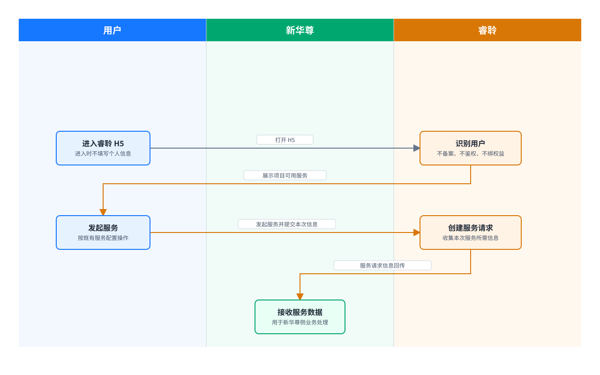

# 新华尊—睿聆 H5 服务对接确认

## 1. 对接服务

- 海外多学科会诊（MDT）
- 海外高端体检
- 海外重疾二诊

## 2. 整体流程

## 3. 规则
1. 用户进入 H5 时不收集姓名、电话、证件等个人信息；不进行会员备案、会员鉴权或权益绑定。
2. 用户发起服务时，睿聆按既有服务发起配置收集本次服务需要的信息并创建服务请求。
3. 服务请求创建成功后，睿聆向新华尊回传本次服务的状态节点、基本信息和服务信息内容。
4. 睿聆回传数据时，若新华想跟自由系统做用户信息确认，则建议在H5 链接携带加密用户标识，用于新华尊侧用户关联。

## 4. 传输内容

| 场景 | 方向 | 传输内容 | 触发时机 |
| --- | --- | --- | --- |
| H5 用户关联（若需要） | 新华尊 → 睿聆 | 项目识别信息、加密用户标识 | 用户打开 H5 链接时 |
| 服务信息回传 | 睿聆 → 新华尊 | 订单号、服务 ID、服务名称、服务状态、下单时间；申请人姓名、证件类型、证件号、性别、出生日期、手机号；意向单各项服务回传字段（待提供） | 服务请求创建成功后 |
| 服务状态同步 | 睿聆（供应商）→ 新华尊 | 服务单回传节点：预约成功、待受理、已完成、已取消、待预约 | 服务状态发生变化时 |
 |
